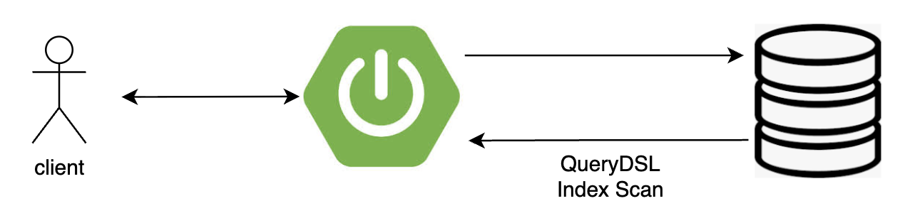
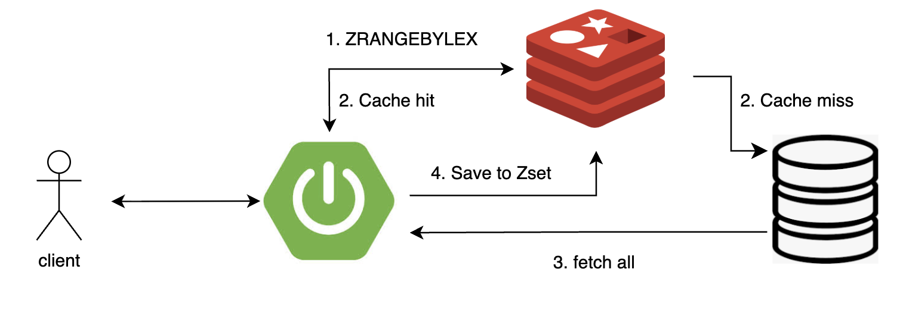
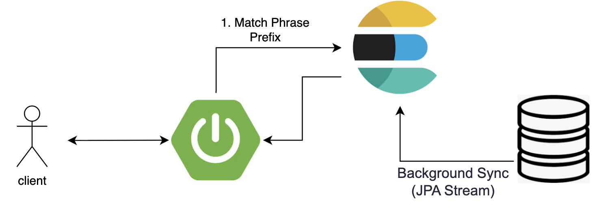
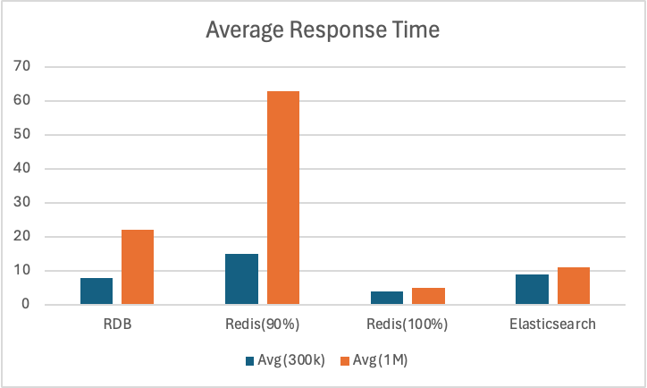
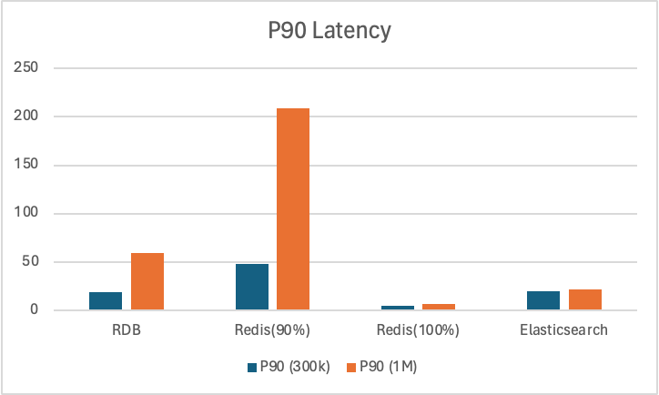

# 🚀 @멘션(Mention) 자동완성 시스템 성능 최적화 프로젝트

---

## 📝 개요
본 프로젝트는 과거 팀 프로젝트 'YelloBook'에서 구현했던 @멘션 자동완성 기능을 재설계하고 성능을 비교하는 과정을 담고 있습니다. 
특히 3만 명 이상의 대규모 팀(Data Skew) 환경에서도 지연 없는 검색 경험을 제공하는 것에 초점을 맞췄습니다.

---

## 🎯 목적
- 레거시 개선: 단순 DB 조회 방식의 한계를 파악하고 실무적인 해결책 도입 
- 기술적 도전: Redis ZSET 및 Elasticsearch를 활용한 검색 아키텍처 비교 분석 
- 성능 벤치마킹: 30만, 100만 건의 데이터셋을 기반으로 각 기술셋의 응답 속도 및 자원 효율성 검증

---

## 🏗️ 아키텍처 진화 과정 및 흐름도

### 1. RDBMS 직접 조회 (QueryDSL)
가장 기본적인 방식으로 사용자 입력마다 DB 쿼리를 날려 결과를 반환합니다.

#### 흐름도

#### 특징 
- 구현이 단순하며 별도의 인프라 비용이 없음.

### 2. Redis ZSET 기반 캐싱
DB 부하를 줄이기 위해 Look-Aside 패턴과 Redis의 Sorted set을 결합했습니다.

#### 흐름도

#### 특징 
- `ZRANGEBYLEX` 명령어를 사용해 접두사 검색 수행
- `maxmemory`제한 및 `allkeys-lru`정책 설정을 통해 cache miss 유발

### 3. Elasticsearch 기반 조회
검색 품질(오타 교정, 형태소 분석 등)과 대용량 데이터 처리를 위해 도입했습니다.

#### 흐름도

#### 특징
- Nori를 활용하여 자연스러운 한글 검색 지원
- `Match Phrase Prefix` 쿼리를 통해 사용자 타이핑 최적화 검색 결과 도출

## 🧪 실험 환경 (Benchmark Setup)

- 데이터 규모
  - 1. 약 30만건
    - 메가 팀 (0 ~ 9): 각 팀당 3만명의 유저
    - 일반 팀 (10 ~ 999): 각 팀당 10명의 유저
  - 2. 약 100만건
    - 메가 팀 (0 ~ 9): 각 팀당 10만명의 유저
    - 일반 팀(10 ~ 999): 각 팀당 10명의 유저
- 테스트 도구: Postman Collection Runner(VU 100으로 설정)
- Redis: 
  - 1번 케이스 30MB, 100MB (cache hit ratio: 90% / 100%)
  - 2번 케이스 100MB, 300MB (cache hit ratio: )

---

## 📊 성능 비교 결과

#### 1. 30만 건

| Metric(30만 건) | Avg Response Time (ms) | Min Response Time (ms) | Max Response Time (ms) | P90(ms) |
|---------------|------------------------|------------------------|------------------------|---------|
| RDB           | 8                      | 1                      | 242                    | 19      |
| Redis (90%)   | 15                     | 1                      | 289                    | 48      |
| Redis (100%)  | 4                      | 1                      | 195                    | 5       |
| Elasticsearch | 9                      | 2                      | 212                    | 20      |

#### 2. 100만 건

| Metric(100만 건) | Avg Response Time (ms) | Min Response Time (ms) | Max Response Time (ms) | P90(ms) |
|----------------|------------------------|------------------------|------------------------|---------|
| RDB            | 22                     | 1                      | 739                    | 59      |
| Redis (90%)    | 63                     | 1                      | 878                    | 209     |
| Redis (100%)   | 5                      | 1                      | 134                    | 7       |
| Elasticsearch  | 11                     | 2                      | 270                    | 22      |

#### 그래프

  <b>Average vs P90 Latency Comparison</b>  
  
  

> Redis는 Cache Hit 100% 환경에서 최상의 성능을 보였지만,  
> Hit Ratio가 낮아질 경우 성능이 급격히 저하되는 한계를 보였습니다.  
> 반면 Elasticsearch는 데이터 규모 증가에도 안정적인 latency를 유지했으며,  
> 대용량 데이터 환경에서는 가장 예측 가능한 성능을 제공하는 구조임을 확인했습니다.
---

## 💡 인사이트

테스트 결과를 통해 데이터 규모와 캐시 히트율에 따라 각 기술 스택이 가지는 명확한 장단점을 확인할 수 있었습니다.

### 1. 30만 건 구간:  RDBMS로도 충분한 성능
인덱스의 힘: 30만 건의 데이터 규모에서는 RDBMS가 평균 8ms의 응답 속도를 기록하며 매우 뛰어난 성능을 보여줬습니다.
복합 인덱스가 메모리(Buffer Pool) 내에서 효율적으로 작동했기 때문입니다.

불필요한 인프라의 오버헤드: 오히려 캐시 미스(Cache Miss)가 10% 발생하는 Redis 환경(평균 15ms)보다 RDBMS를 직접 조회하는 것이 전반적으로 더 나은 성능을 보여줬습니다. 
이는 일정 규모 이하에서는 무조건적인 캐시 도입보다 DB 인덱스 튜닝이 더 효과적일 수 있음을 시사합니다.

### 2. 100만 건 구간: Elasticsearch의 안정성
RDBMS의 한계 노출: 데이터가 100만 건으로 증가하자 RDBMS는 P90 지표가 19ms에서 59ms로, Max 지표가 739ms까지 치솟으며 병목의 조짐을 보였습니다. 
데이터 스큐(3만 명의 메가 팀) 환경에서 정렬과 페이징 부하가 커졌기 때문입니다.

안정적인 검색 엔진: 반면 Elasticsearch는 데이터가 3배 이상 증가했음에도 평균 11ms, P90 22ms라는 매우 균일하고 안정적인 성능을 보여줬습니다.
대용량 데이터 환경에서는 ES의 역색인(Inverted Index) 구조가 RDB 대비 훨씬 더 나은 성능과 안정성을 제공함을 확인했습니다.

### 3. Redis의 양면성 (Cache Hit Rate의 중요성)
Hit 100% vs 90%: 캐시 히트율이 100%일 때 Redis는 모든 지표에서 가장 빠른 속도(평균 4~5ms)를 자랑합니다. 
하지만 메모리 제한(Eviction) 등으로 인해 히트율이 90%로 떨어지면, 100만 건 기준 평균 응답 시간이 63ms(Max 878ms)로 급격히 무너집니다.

대규모 팀(3만 ~ 10만)의 데이터를 DB에서 퍼올려 Redis의 ZSET에 다시 쓰는(Write) 과정에서 발생하는 오버헤드가 전체 시스템의 레이턴시를 갉아먹는 주요 원인임을 확인했습니다.

---

## 💡 최종 아키텍처 의사결정
"데이터 규모가 수십만 건 이하일 때는 RDBMS 최적화만으로도 충분한 성능을 낼 수 있습니다. 
하지만 서비스가 확장되어 100만 건 이상의 대용량 데이터와 극한의 데이터 쏠림 현상이 예상된다면, RDB 부하를 줄이고 일관된 응답 속도를 보장하는 Elasticsearch 도입이 가장 합리적인 아키텍처 선택입니다."